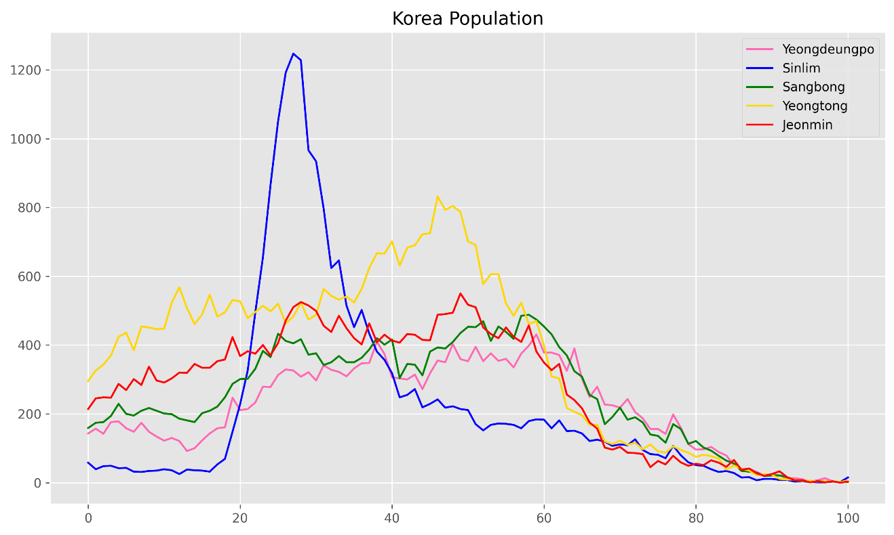
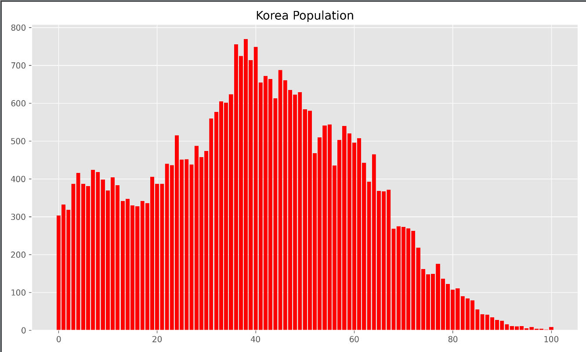
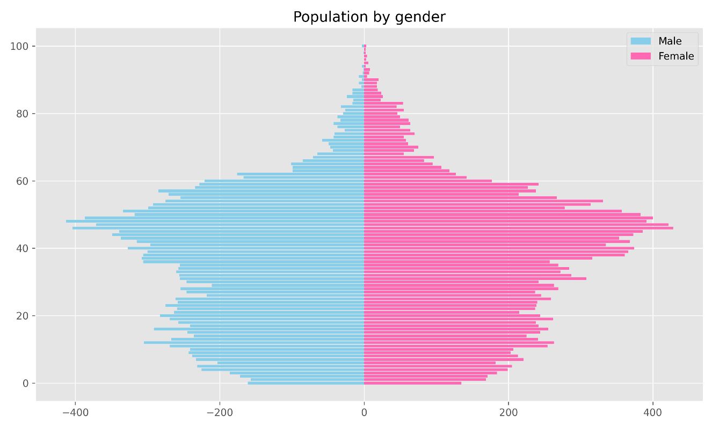
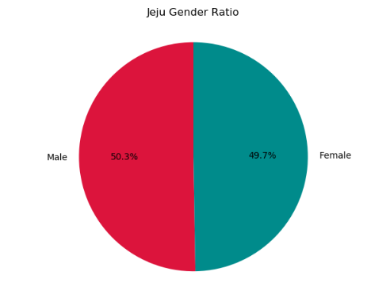
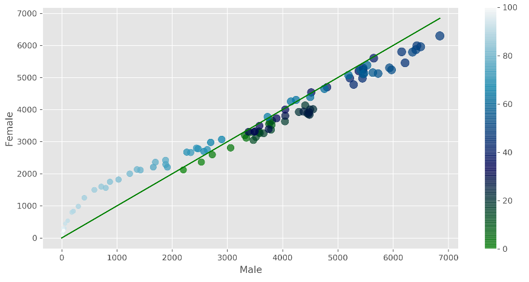

## Data Analysis With Python Practice
------

### DA1 (Temperature analysis with public csv data)

- highest temperature print

- biggest high and low temperature print

### DA2 (Data Visualization with matplotlib)

- high and low temperature liner chart

- winter and summer temperature histogram

- average temperature box plot graph in august

### DA3 (Korea Population analysis with public csv data)

- korea population liner chart

- district population by input value

- population ratio by gender    

- Jeju population ratio pie chart by gender   

- Jeju population ratio scatter chart by gender    

