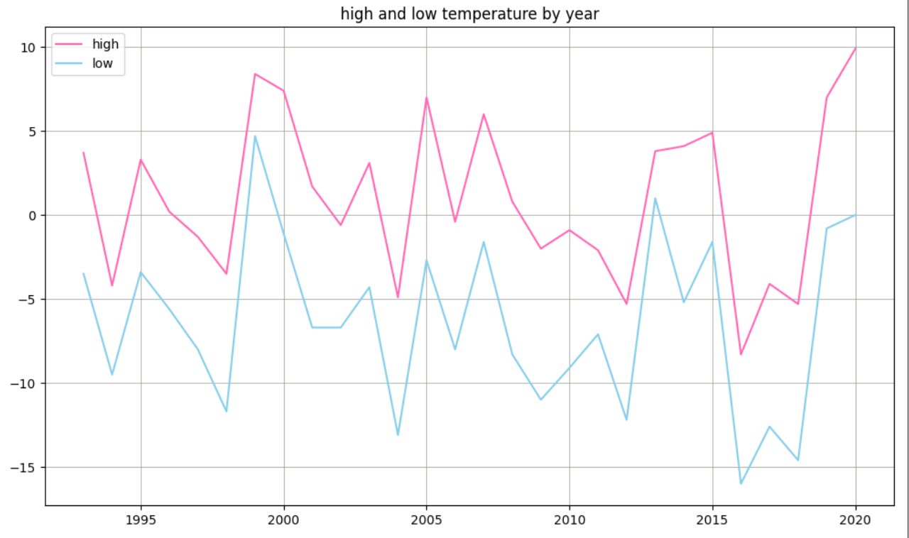
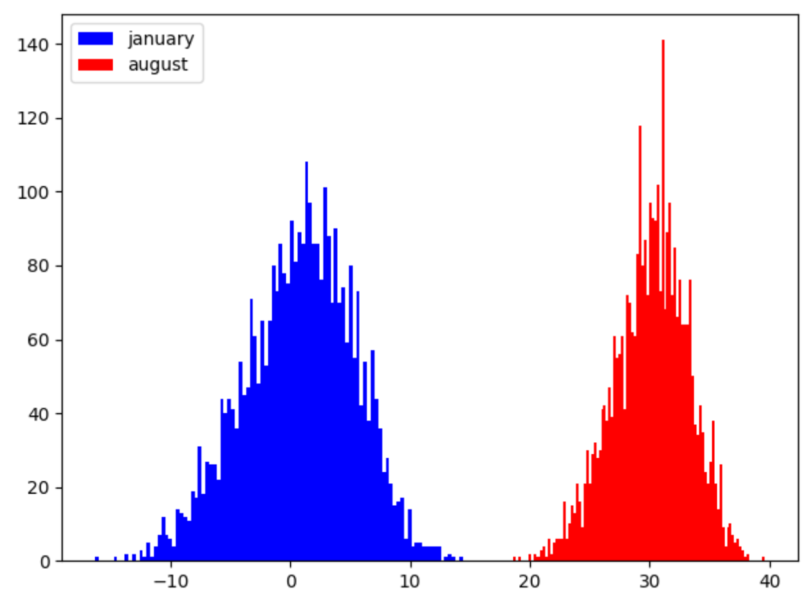
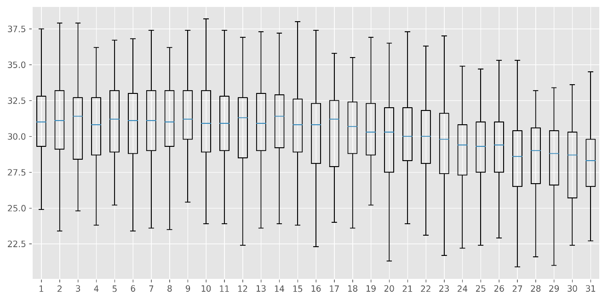

## Data Analysis With Python Practice
=====

### DA1 (Temperature analysis with public csv data)

- highest temperature print

- biggest high and low temperature print

### DA2 (Data Visualization with matplotlib)

- high and low temperature liner chart

- winter and summer temperature histogram

- average temperature box plot graph in august

